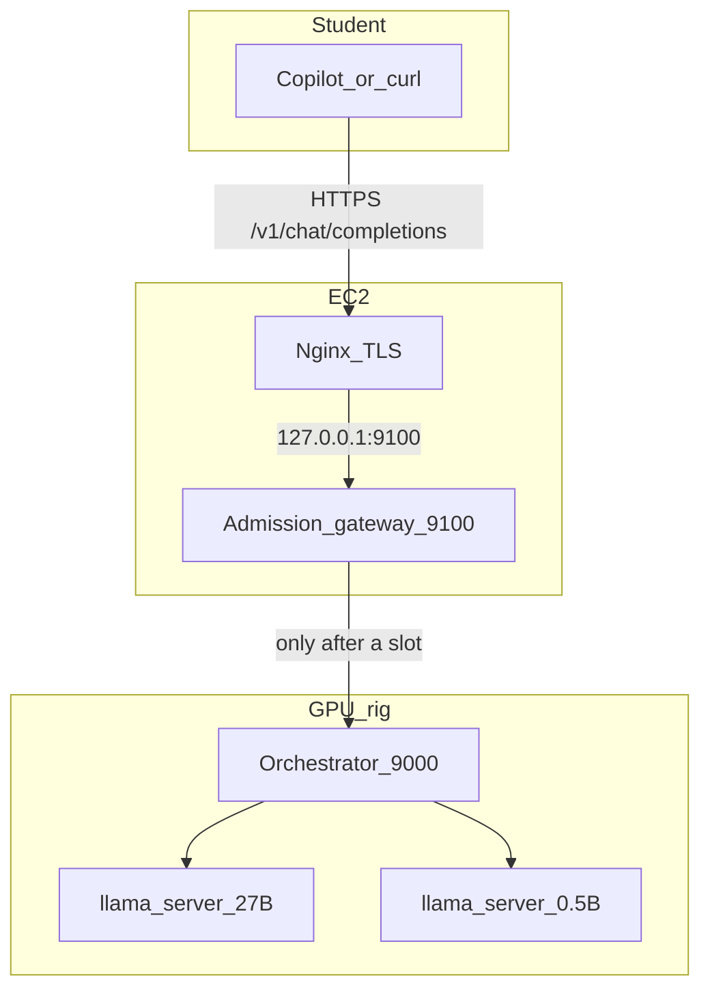
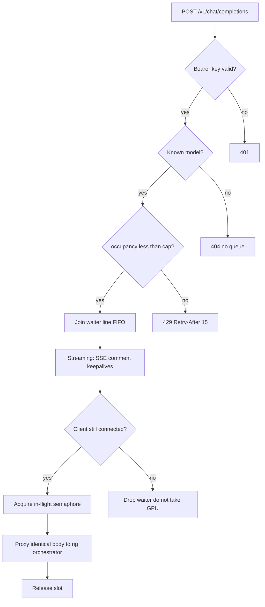

# The admission gateway

OCS Intelligence is a classroom API in front of seven GTX 1070s. Those cards can run **one** serious 27B completion at a time, or **two** tiny 0.5B ones. They cannot run a lab of Copilot tabs. The admission gateway is the piece that makes that hardware usable by many students anyway.

It sits on EC2, in front of the GPU rig. Students still speak ordinary OpenAI Chat Completions. The rig still only sees as many live inferences as it can actually serve. Everyone else waits in a fair line — or gets a clean 429 when the line is full.

This is the difference between “the API works in a demo” and “the API survives 4th period.”

---

## Why this exists

Worker A (`qwen3.8:27b`) generates around **9 tokens per second** across five Pascal GPUs linked by PCIe x1 risers. A typical Copilot reply is tens of seconds. Two overlapping 27B jobs do not make the class twice as fast; they fight over the same slow fabric and KV cache.

Before the gateway, the public path was:

```text
Copilot → Nginx → rig orchestrator → llama-server
```

The orchestrator forwarded every authenticated request immediately. Sixteen in-flight was a *reject* threshold, not a wait line. The GPUs saw a stampede. `llama-server` would return “no slot,” hang, or worse.

Sending that stampede at a mining board on school WiFi is how you take the whole service down. The fix is not “run more jobs on the 1070s.” The fix is **admission control on a machine that can hold HTTP connections cheaply.**

EC2 is that machine. It already terminates TLS. It has a reliable network. It is the place a second rig will attach later. Waiting belongs here. Inference belongs on the rig.

---

## What students experience

Nothing in Copilot’s config changed.

| | |
|---|---|
| Base URL | `https://ai.opencodingsociety.com/v1` |
| Protocol | OpenAI Chat Completions, streaming or blocking |
| Auth | Shared Bearer key (checked **before** you join the line) |

If a GPU slot is free, the request goes through. Time-to-first-token is the model, not the queue.

If the slot is busy and the line has room, the HTTPS connection **stays open**. Streaming clients may see SSE comments (`: queued`) every ~15 seconds. OpenAI clients ignore comments; Nginx and Copilot see a live socket instead of an idle timeout.

If the line is full, the gateway answers immediately:

```json
{"detail":{"error":{"message":"Too many requests. Please retry later.","type":"rate_limit_error","code":"rate_limit_exceeded"}}}
```

HTTP **429**, `Retry-After: 15`. Measured live on 2026-09-18: seventh concurrent `qwen2.5:0.5b` stream, with six already in the system.

Close the tab and you leave the line. You do not keep a GPU slot warm for a ghost.

---

## Capacity (what “survive concurrent requests” actually means)

Two independent lanes, one per model. They do not steal slots from each other.

| Lane | Model | GPUs | In flight | Waiting | Total HTTP connections | 7th / 6th request |
|---|---|---|---:|---:|---:|---|
| A | `qwen3.8:27b` | 5 | **1** | **4** | 5 | 6th → 429 |
| B | `qwen2.5:0.5b` | 2 | **2** | **4** | 6 | 7th → 429 |

Live check, same day:

- Worker B, 7 parallel streams → **6 × HTTP 200, 1 × HTTP 429**
- Worker A, 6 parallel streams → **5 × HTTP 200, 1 × HTTP 429**, keepalives observed on A

`/v1/models` and `/healthz` never take a GPU slot.

There is **no wait timeout**. You wait until a slot frees. Nginx `proxy_read_timeout` on `/v1/` is 3600s so a long 27B line does not get cut at 10 minutes. That timeout is a socket safety net, not a queue policy.

One huge 27B completion can still occupy Worker A’s only running slot for a long time. The line bounds *how many people sit behind that*, not how long one job is allowed to think. That trade-off was explicit.

---

## Inner workings

### Path of a completion



Nginx binds the public name and TLS. The gateway binds **localhost only**, so the wait line is not a second public surface. One Uvicorn worker: the line is in-process memory. Two workers would be two lines that cannot see each other.

### Decision order

Code: [`gateway/main.py`](./gateway/main.py), [`gateway/lanes.py`](./gateway/lanes.py), [`gateway/auth.py`](./gateway/auth.py).



1. **Authenticate first.** A missing or wrong key never increments occupancy. Five forged keys during a busy Worker B all returned 401; `/v1/models` with the real key still returned 200.
2. **Unknown model → 404**, no lane.
3. **Admit or 429.** Occupancy is `waiting + in_flight`. Cap is `inflight_limit + max_waiters`. A burst of five 27B requests is allowed (1 will run, 4 wait). The sixth is rejected before any GPU work.
4. **One `Semaphore.acquire()` task per request.** Timing out and retrying acquire would cancel it and send the student to the **back** of the line. The gateway waits on that single task, and uses the wait only to emit keepalives and poll disconnect.
5. **Leave the waiter count when the GPU slot is taken** (or when the client is gone). Holding the semaphore is in-flight, not waiting.
6. **Proxy is dumb on purpose.** Same JSON body, same student Bearer key (the rig still authenticates). SSE bytes pass through. `X-Accel-Buffering: no` so Nginx does not hoard tokens.
7. **Release in `finally`.** A failed upstream, a finished stream, or a closed tab all give the slot to the next waiter.

### FIFO, keepalives, and disconnect

Streaming wait is the same acquire loop as blocking wait, with one extra yield:

```text
: queued
```

That is an SSE *comment*. It is not a fake token. It exists so a 15-second idle socket does not look dead to the proxy while a 27B job ahead of you finishes.

If Copilot disconnects during the wait, acquire is cancelled. If the semaphore was granted in the same instant as cancel, it is released. The next student does not inherit a dead connection’s GPU turn.

### What the gateway does *not* do

- It does not run models.
- It does not use Redis, SQS, or a job queue. Copilot holds a live HTTP stream; there is no “we will call you back.”
- It does not change `--parallel` on `llama-server`. The rig can still take a second 27B job if something bypasses EC2.
- It does not see Open WebUI. Browser chat still goes `Nginx → rig :3000` and skips this line.

Those are boundaries, not unfinished sentences. The gateway’s job is one thing: **never let the public internet decide how many inferences the 1070s run.**

---

## Why the queue lives on EC2

| If the wait line were on the rig | What goes wrong |
|---|---|
| Waiting connections compete with inference for a 2-core box on USB WiFi | The machine that should be generating tokens is busy holding sockets |
| School network flakes | Queue process dies with the rig |
| A second rig comes online | You duplicate queue state, or you move it anyway |

EC2 already has the only public IP students use. Putting the line there means:

- The rig only receives work it can start.
- A future second rig is another upstream behind the same gateway, not a new student-facing URL.
- Auth, 429, and keepalives stay on a host that can reach PyPI and stay up independently of the mining board.

The orchestrator on the rig remains the model router (`qwen3.8:27b` → port 8081, `qwen2.5:0.5b` → 8082) and still injects the worker-only API key. Two thin layers, two jobs.

---

## What this buys the class

Without the gateway, “lots of concurrent Copilot requests” means overlapping 27B jobs, slot exhaustion, and a service that looks random: some tabs hang, some 502, the board gets hot, everyone retries, the pile gets worse.

With it:

- At most **one** 27B and **two** 0.5B generations touch silicon at once.
- Up to four classmates per model have a real place in line, not a dropped TCP connection.
- Past that, Copilot gets a standard 429 instead of a mystery timeout.
- Closing a tab is polite: the next person moves up.
- The public contract stays OpenAI-compatible. Nobody installs a custom client.

That is the whole product: a slow, honest GPU cluster that **fails in a language Copilot already understands**, instead of failing as a crashed box.

---

## Code map

| File | Role |
|---|---|
| [`gateway/main.py`](./gateway/main.py) | FastAPI: auth, 404/429, streaming vs blocking |
| [`gateway/lanes.py`](./gateway/lanes.py) | Per-model FIFO semaphore, occupancy, keepalives, cancel |
| [`gateway/auth.py`](./gateway/auth.py) | Bearer check against `PUBLIC_API_KEYS` |
| [`gateway/proxy.py`](./gateway/proxy.py) | httpx to `http://100.75.123.203:9000` |
| [`gateway/config.py`](./gateway/config.py) | Caps and timeouts from env |
| [`systemd/ocs-gateway.service`](./systemd/ocs-gateway.service) | `127.0.0.1:9100`, `--workers 1` |
| [`llm-relay-nginx.conf`](./llm-relay-nginx.conf) | `/v1/` → localhost:9100, 3600s read/send |

Deployed on EC2 as `/opt/ocs-gateway` with `/etc/ocs-gateway/gateway.env` (mode `0600`, not in git). How to call the API, including Copilot and verbatim responses: [`USAGE.md`](./USAGE.md). Live demo script: [`scripts/demo.py`](./scripts/demo.py). What is running tonight: [`STATUS.md`](./STATUS.md).

---

## Honest limits

- **Shared student key.** The line is first-come, not per person. One retry loop can fill both lanes. Per-student keys are the next fairness step; they are not implemented.
- **No max_tokens cap.** A long 27B generation holds the only quality slot until it finishes.
- **Rig `:9000` is still reachable on NetBird.** Anyone who talks to the orchestrator directly skips the line. UFW was deferred.
- **Worker A is still slower than the old 7-GPU Ollama baseline.** The gateway keeps that model from falling over. It does not make it faster.

The gateway does not pretend the 1070s are a cloud GPU. It makes a small, real cluster behave like a service: bounded, ordered, and still there when the bell rings.
