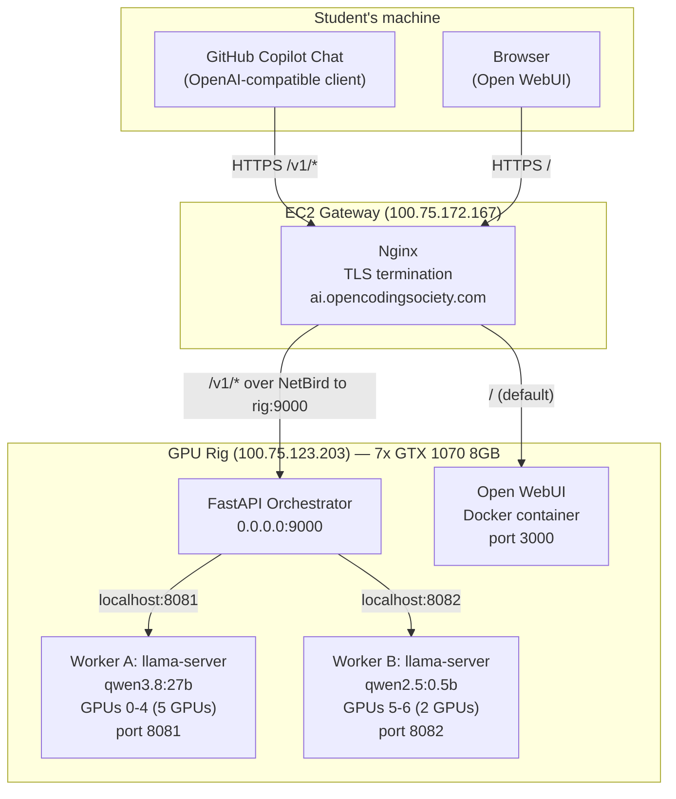
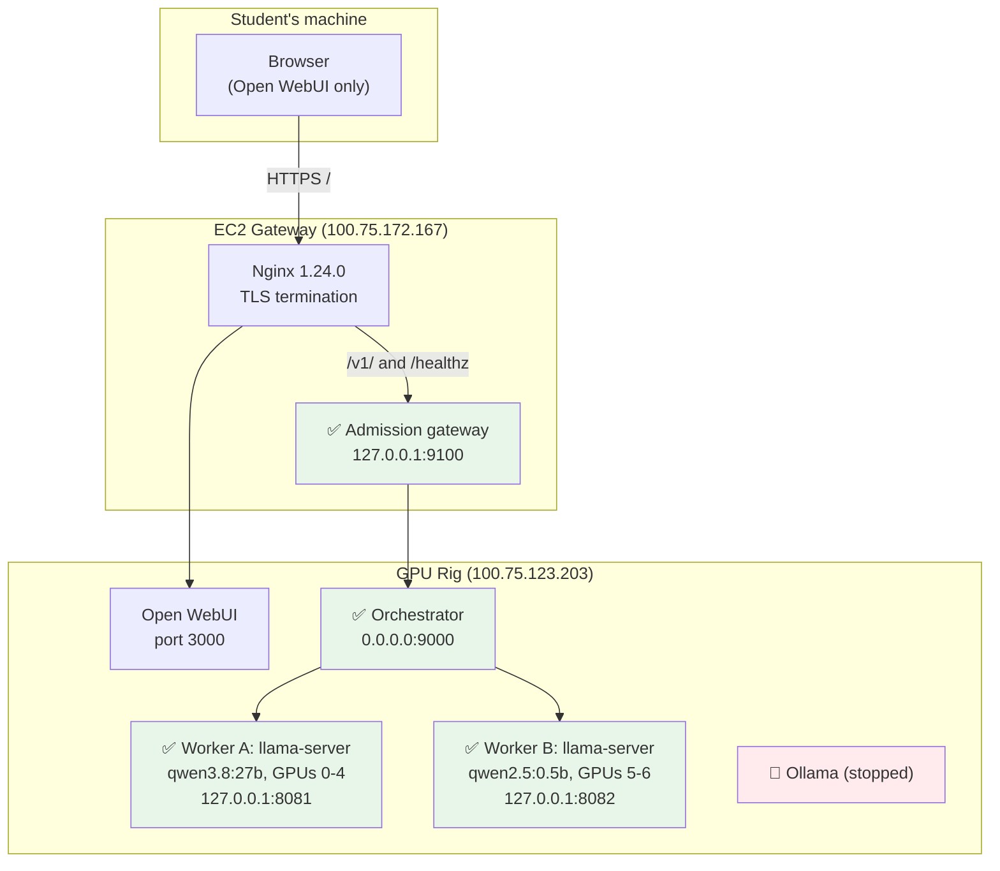

# OCS Intelligence — Current Status & Architecture

_Last updated: 2026-09-18 (EC2 admission gateway live), based on live verification over NetBird SSH._

This document describes what is **actually running right now**, how it works end to end, and what's left to do. How the EC2 wait line works: [`GATEWAY.md`](./GATEWAY.md). Original execution plan: [`CURSOR_HANDOFF.md`](./CURSOR_HANDOFF.md). Superseded planning docs live in [`archive/`](./archive/).

---

## 1. TL;DR status

| Component | Status |
|---|---|
| CUDA 12.6 toolkit on rig (`sm_61`/Pascal support) | ✅ Installed, verified |
| `llama.cpp` built with CUDA backend | ✅ Built, all 7 GPUs detected |
| Model symlinks (`/srv/ocs-intelligence/models/`) | ✅ Done |
| Worker A (`qwen3.8:27b`, 5 GPUs, port 8081) | ✅ Running, healthy |
| Worker B (`qwen2.5:0.5b`, 2 GPUs, port 8082) | ✅ Running, healthy |
| Ollama (old single-worker path) | 🛑 Stopped (freed for the two new workers) |
| FastAPI orchestrator (on the rig, `:9000`) | ✅ Running, healthy; routes both models |
| EC2 admission gateway (`127.0.0.1:9100`) | ✅ Running; auth + wait line, then proxy to the rig |
| EC2 Nginx `/v1/` route | ✅ Live → localhost gateway; `/` still Open WebUI |
| Open WebUI | ✅ Still running (port 3000, untouched) |
| **Open issue:** Worker A throughput | ⚠️ 8.7 tok/s, *slower* than the 12.5 tok/s baseline — NCCL deferred; see [§6](#6-open-issue-worker-a-is-slower-than-baseline) |

**In short:** workers, orchestrator, public `/v1/` path, and the EC2 wait line are live. **Why the wait line exists and how it is implemented:** [`GATEWAY.md`](./GATEWAY.md). Student API calls and **verbatim captures** are in [`USAGE.md`](./USAGE.md). Open WebUI at `/` still reports 0.11.3. Worker A vs the old Ollama baseline is still open; NCCL is deferred.

---

## 2. Architecture

### 2.1 Target end-state (per `CURSOR_HANDOFF.md`)



### 2.2 Actual current state (verified live)



**Key point:** workers remain bound to `127.0.0.1` on the rig. Nginx on EC2 splits traffic: `/v1/` and `/healthz` go to the local admission gateway on `:9100`; everything else still goes to Open WebUI on `:3000`. The gateway authenticates, holds extra clients in a per-model wait line (A: 1 in-flight + 4 waiters; B: 2 + 4), then proxies to the rig orchestrator. Nginx backup before this change: `/etc/nginx/sites-available/llm-relay.bak.20260918T044602Z`.

### 2.3 Request path once fully wired up

```mermaid
sequenceDiagram
    participant S as Student (Copilot Chat)
    participant N as EC2 Nginx
    participant G as EC2 admission gateway
    participant O as FastAPI Orchestrator
    participant A as Worker A (llama-server, 27B)
    participant B as Worker B (llama-server, 0.5B)

    S->>N: POST https://ai.opencodingsociety.com/v1/chat/completions
    N->>G: proxy_pass http://127.0.0.1:9100
    G->>G: Bearer auth; per-model wait line
    G->>O: proxy_pass http://100.75.123.203:9000
    O->>O: auth check, routing.py resolves model name
    alt model == qwen3.8:27b
        O->>A: POST http://127.0.0.1:8081/v1/chat/completions\n(worker secret injected)
        A-->>O: SSE stream of tokens
    else model == qwen2.5:0.5b
        O->>B: POST http://127.0.0.1:8082/v1/chat/completions
        B-->>O: SSE stream of tokens
    end
    O-->>G: SSE passthrough
    G-->>N: SSE passthrough
    N-->>S: SSE passthrough
```

---

## 3. What we actually did (chronological)

1. **Connected to both machines** over NetBird SSH, routed through the local `netbird-dev` Docker container. Because NetBird SSH triggers a browser SSO prompt for every *new* SSH connection, we set up two long-lived interactive sessions instead of one-off commands — a named FIFO (`mkfifo`) feeds `tail -f fifo | ssh -tt ...`, so we authenticate once per host and then just write commands into the FIFO for the rest of the session.
2. **Found and cleaned up a stale, half-finished deployment attempt** from a previous session: a background process was stuck for 25+ minutes re-trying `apt-get install cuda-toolkit-12-6` because of a transient DNS resolution failure (the rig is on a school WiFi network via a slow USB 2.0 dongle, with occasional site-blocking/DNS flakiness). Killed it, cleared the `dpkg` lock, and restarted cleanly.
3. **Step 1 — Installed CUDA 12.6 toolkit** (`/usr/local/cuda-12.6`). This is required because CUDA 13 (what was previously on the system via a Python venv) dropped support for Pascal (`sm_61`, i.e. the GTX 1070's compute capability). Download was ~4.5GB over the slow rig WiFi, took about 80 minutes.
4. **Step 2 — Built `llama.cpp` from source** with `-DGGML_CUDA_ARCHITECTURES=61`, targeting the correct `nvcc` this time. Build took ~35 minutes on the rig's 2 CPU cores. Verified `llama-server --list-devices` sees all 7 GPUs.
5. **Step 3 — Set up model directories**: symlinked the existing Ollama GGUF blobs into `/srv/ocs-intelligence/models/` under friendly names, without duplicating the ~17GB of model data.
6. **Step 4 — Deployed the two systemd workers**:
   - Generated a shared worker secret (`openssl rand -hex 24`).
   - Wrote `/etc/ocs-intelligence/worker-a.env` and `worker-b.env` (mode `0600`).
   - Installed `ocs-llama-a.service` / `ocs-llama-b.service` to `/etc/systemd/system/`.
   - **Hit and fixed a bug**: the version of `llama.cpp` we built changed `--flash-attn` from a bare boolean flag to one that requires an explicit value (`on`/`off`/`auto`). The original service files (copied verbatim from the plan) passed a bare `--flash-attn`, which caused `llama-server` to swallow the next argument (`--metrics`) as its value and crash-loop. Fixed by changing to `--flash-attn on` in both service files (and updated the checked-in templates to match).
   - Stopped `ollama.service` to free all VRAM, then started both workers. Confirmed via `nvidia-smi` that GPUs are fully freed before the workers claim them.
7. **Verified both workers end-to-end** with real `/v1/chat/completions` requests (see timings below).
8. **Step 5 — Deployed the FastAPI orchestrator on the rig** (not EC2). PyPI is DNS-blocked from school WiFi, so deps came from Ubuntu packages into a `--system-site-packages` venv. Service `ocs-orchestrator` is enabled and listening on `0.0.0.0:9000`. Verified `/healthz`, `/readyz`, `/v1/models`, 401 without a key, and a Worker B completion through the orchestrator (~91 tok/s). NCCL left for later.
9. **Step 6 — EC2 Nginx `/v1/`**. Backed up `llm-relay`, added `/v1/` (no URI rewrite, so `/v1/models` stays `/v1/models` on the orchestrator) and exact `/healthz`. `nginx -t` passed, then reload. Kasm and default vhosts were not edited.
10. **Step 7 — Public e2e tests (2026-09-17):** 9/9 passed — `/healthz`, WebUI `/api/version` 0.11.3, 401 without a key, both models listed, unknown model 404, 0.5b blocking (~87 tok/s) and SSE, 27b blocking (~8.6 tok/s, real answer) and SSE. Open WebUI login page loads in the browser. Copilot Chat itself was not signed into.
11. **EC2 admission gateway (2026-09-18):** FastAPI process `ocs-gateway` on `127.0.0.1:9100` with in-process per-model lanes (A: 1 in-flight + 4 waiters; B: 2 + 4). Nginx `/v1/` and `/healthz` now point at localhost; `proxy_read_timeout` / `proxy_send_timeout` on `/v1/` raised to 3600s. Live concurrency: B 6×200+1×429, A 5×200+1×429; invalid keys 401 without occupying the line. Rig workers and orchestrator were not changed.

---

## 4. Actual deployed configuration

### 4.1 Rig inventory (verified via `nvidia-smi`)

| GPU index | UUID | PCI bus | Assigned to |
|---:|---|---|---|
| 0 | `GPU-24899ea8-3258-0dd0-5aa4-6ef9104cdc68` | `03:00.0` | Worker A |
| 1 | `GPU-728d79b7-b5ed-e1ec-cf29-0572f97956ba` | `08:00.0` | Worker A |
| 2 | `GPU-fb4eb983-84aa-664f-b97d-94b12caffb37` | `0A:00.0` | Worker A |
| 3 | `GPU-71f15481-4db3-9d2a-8d30-6e68dba08617` | `0B:00.0` | Worker A |
| 4 | `GPU-bc07dc85-473b-9927-538e-986f80b80486` | `0C:00.0` | Worker A |
| 5 | `GPU-2a70bbf9-ed03-162f-ddd5-c7ed42149d84` | `0E:00.0` | Worker B |
| 6 | `GPU-a25606af-913d-22d1-5ebe-ecea656819cb` | `0F:00.0` | Worker B |

### 4.2 `/etc/ocs-intelligence/worker-a.env` (actual, secret redacted)

```ini
CUDA_VISIBLE_DEVICES=GPU-24899ea8-3258-0dd0-5aa4-6ef9104cdc68,GPU-728d79b7-b5ed-e1ec-cf29-0572f97956ba,GPU-fb4eb983-84aa-664f-b97d-94b12caffb37,GPU-71f15481-4db3-9d2a-8d30-6e68dba08617,GPU-bc07dc85-473b-9927-538e-986f80b80486
DEFAULT_MODEL_GGUF=/srv/ocs-intelligence/models/qwen3.8-27b-q4_k_m.gguf
DEFAULT_MODEL_ID=qwen3.8:27b
CONTEXT_SIZE=4096
TENSOR_SPLIT=1,1,1,1,1
WORKER_API_KEY=<redacted — 48-char hex, openssl rand -hex 24>
```

### 4.3 `/etc/ocs-intelligence/worker-b.env` (actual, secret redacted)

```ini
CUDA_VISIBLE_DEVICES=GPU-2a70bbf9-ed03-162f-ddd5-c7ed42149d84,GPU-a25606af-913d-22d1-5ebe-ecea656819cb
SPEED_MODEL_GGUF=/srv/ocs-intelligence/models/qwen2.5-0.5b.gguf
SPEED_MODEL_ID=qwen2.5:0.5b
CONTEXT_SIZE=8192
TENSOR_SPLIT=1,1
WORKER_API_KEY=<redacted — same key as worker A>
```

Both workers share one worker-only secret; this is intentional (see `orchestrator/config.py` — the orchestrator injects it, callers never see it).

### 4.4 `/etc/systemd/system/ocs-llama-a.service` (actual, as deployed and fixed)

```ini
[Unit]
Description=OCS llama.cpp worker A - qwen3.8:27b on 5 GPUs
After=network-online.target netbird.service
Wants=network-online.target

[Service]
Type=simple
EnvironmentFile=/etc/ocs-intelligence/worker-a.env
UnsetEnvironment=GGML_CUDA_P2P
ExecStart=/opt/llama.cpp/bin/llama-server \
  --host 127.0.0.1 \
  --port 8081 \
  --model ${DEFAULT_MODEL_GGUF} \
  --alias ${DEFAULT_MODEL_ID} \
  --api-key ${WORKER_API_KEY} \
  --n-gpu-layers 999 \
  --split-mode layer \
  --tensor-split ${TENSOR_SPLIT} \
  --ctx-size ${CONTEXT_SIZE} \
  --parallel 2 \
  --cont-batching \
  --flash-attn on \
  --metrics \
  --slots \
  --warmup
Restart=on-failure
RestartSec=5
TimeoutStartSec=600
TimeoutStopSec=90
NoNewPrivileges=true
PrivateTmp=true
ProtectSystem=strict
ProtectHome=true
ReadOnlyPaths=/srv/ocs-intelligence/models
ReadWritePaths=/var/lib/ocs-intelligence
LimitNOFILE=1048576

[Install]
WantedBy=multi-user.target
```

`ocs-llama-b.service` is identical except `port 8082`, `worker-b.env`, and `TimeoutStartSec=300` (smaller model, faster startup). Both files live in [`systemd/`](./systemd/) in this repo, kept in sync with what's on the rig.

### 4.5 `llama-server` binary details

- Built at `/opt/llama.cpp/src/build` (commit `972d231`, version `0.4.1-dev`), installed to `/opt/llama.cpp/bin/llama-server` and `llama-bench`.
- The installed binary has an **absolute `RUNPATH`** (`/opt/llama.cpp/src/build/bin`), so it depends on the build directory staying in place — it is *not* a fully self-contained static binary. This is fine as long as nobody deletes `/opt/llama.cpp/src/build`.
- Confirmed dynamically linked against `libggml-cuda.so.0`, `libcudart.so.12`, `libcublas.so.12`, `libcuda.so.1` — CUDA backend is real and working.
- **No NCCL.** Build output: `-- Could NOT find NCCL ... Warning: NCCL not found, performance for multiple CUDA GPUs will be suboptimal`. This is the leading suspect for the performance issue below.

---

## 5. Verified performance (live measurements, not simulated)

| Worker | Model | GPUs | Prompt processing | Generation | Notes |
|---|---|---:|---:|---:|---|
| B | `qwen2.5:0.5b` | 2 (1 PCIe hop) | 216 tok/s | **80.8 tok/s** | Full response, no truncation |
| A | `qwen3.8:27b` | 5 (4 PCIe hops) | 23.2 tok/s | **8.7 tok/s** | Truncated at `max_tokens` — this is a *reasoning* model that spends tokens on hidden `reasoning_content` before answering; not a bug, just needed a bigger token budget for a full test |

**Baseline for comparison** (from `CURSOR_HANDOFF.md`, all 7 GPUs via Ollama, 6 PCIe hops): ~12.5 tok/s generation, ~10.85 tok/s prompt eval.

Worker B is a clear win — nearly **6.5x** the baseline throughput on the small model, as expected from cutting hops from 6 to 1.

Worker A is a problem — **slower** than baseline (8.7 vs 12.5 tok/s) despite fewer PCIe hops (4 vs 6). See below.

---

## 6. Open issue: Worker A is slower than baseline

This is the one thing standing between "technically works" and "actually done." Two candidate explanations, not yet root-caused:

1. **Missing NCCL.** The build warned that without NCCL, multi-GPU reductions fall back to a slower path. We identified that installing NCCL would require ~474MB of downloads (only CUDA 13.3/13.4-linked packages are available, not CUDA 12.6 — a version mismatch risk). **NCCL is deferred** until after the public `/v1/` path is live.
2. **Single short, cold request isn't representative.** We only ran one very short prompt through Worker A. `llama-bench` (already built and installed) would give a cleaner, repeatable number, isolating decode speed from prompt-processing/warm-up effects.

**Neither has been tried yet.** This needs to be resolved before declaring the 5+2 split a genuine improvement over the old 7-GPU Ollama setup — right now it's a regression on the model most students will actually use.

---

## 7. Other things worth knowing

- **Rig disk usage grew by ~4.3GB** — that's `apt`'s package cache from the CUDA install (`/var/cache/apt/archives/`), safe to clear with `apt-get clean` to reclaim space (rig has 151GB free, so not urgent, just tidy).
- **EC2 disk is about 61%** (~19GB free of 48GB) after removing unused Kasm 1.16.0. The admission gateway venv is small.
- **Ollama is stopped, not removed.** `systemctl start ollama.service` would bring back the old path (after stopping the two new workers and freeing VRAM).
- **Open WebUI was never touched** and is still running on port 3000. Direct Ollama-backed chat in WebUI will fail while Ollama is stopped. WebUI traffic still bypasses the EC2 wait line.
- **Workers stay on localhost; the orchestrator is still reachable on the rig's `:9000` over NetBird.** The public `/v1/` path goes through the EC2 gateway. There is still no UFW rule restricting rig port 9000 to the EC2 NetBird IP — a NetBird peer can still skip the wait line.
- **PyPI is unreachable from the rig** (DNS timeout on school WiFi). Orchestrator deps were installed from Ubuntu 24.04 packages (`python3-fastapi` 0.101.0, `python3-uvicorn` 0.27.1, `python3-httpx` 0.26.0) into a venv with `--system-site-packages`. The systemd unit therefore runs `python -m uvicorn`, not a venv-local `uvicorn` binary. The EC2 gateway venv was installed from PyPI (FastAPI 0.141.1).

---

## 8. Next steps (decided / proposed)

In rough priority order:

1. **NCCL / Worker A throughput** — deferred.
2. **Per-student API keys** — documented only; still one shared Bearer key. Needed so one laptop cannot fill the wait line.
3. **Housekeeping**: `apt-get clean` on the rig. Optionally restrict rig port 9000 to the EC2 NetBird IP so the wait line cannot be bypassed.
4. Copilot Chat from a student machine (API path is verified; see [`USAGE.md`](./USAGE.md)).

---

## 9. Access notes for continuing this work

- Both machines are reached through NetBird SSH via the local `netbird-dev` Docker container (`docker exec -it netbird-dev sh`, then `ssh root@<netbird-ip>`).
- NetBird SSH requires a fresh browser SSO approval for *every new SSH connection* — to avoid repeated prompts, use one persistent session per host: `mkfifo /tmp/x.fifo; tail -f /tmp/x.fifo | ssh -tt root@<ip>`, then send further commands by writing to the FIFO (`echo 'some command' > /tmp/x.fifo`) rather than opening new connections.
- Rig: `root@100.75.123.203` (`ocs-intelligence-rig`). EC2: `root@100.75.172.167` (`ip-172-31-42-43`).
