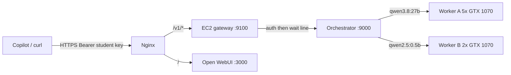

# OCS Intelligence API — how it works and how to use it

Live endpoint: `https://ai.opencodingsociety.com/v1`

This is an OpenAI-compatible Chat Completions API in front of two `llama.cpp` workers on the GPU rig. An admission gateway on EC2 holds extra clients in a wait line so the GPUs are not flooded. Captured **2026-09-17** from real public `curl` calls (API path) and **2026-09-18** for the queue (7/7 sync checks plus concurrency).

The student API key is **not committed**. Copy [`.env.example`](./.env.example) to `.env` (gitignored) on your machine. Operators already have a local `.env` in this checkout.

```bash
cp .env.example .env   # then set OCS_API_KEY
set -a && source .env && set +a
```

---

## 1. What was built

| Piece | Where it runs | Role |
|---|---|---|
| Nginx | EC2 `ai.opencodingsociety.com` | TLS. `/v1/` and `/healthz` → admission gateway. `/` → Open WebUI |
| Admission gateway | EC2 `127.0.0.1:9100` | Auth, per-model wait line, SSE keepalives, then proxy to the rig |
| FastAPI orchestrator | GPU rig `:9000` | Bearer auth, model routing, SSE passthrough |
| Worker A | rig `127.0.0.1:8081` | `qwen3.8:27b` on GPUs 0–4 |
| Worker B | rig `127.0.0.1:8082` | `qwen2.5:0.5b` on GPUs 5–6 |
| Open WebUI | rig `:3000` | Existing chat UI at `/` (unchanged) |

The worker-only secret stays on the rig (`/etc/ocs-intelligence/worker-*.env` and `/etc/ocs-orchestrator/orchestrator.env`). Clients never see it. The orchestrator swaps the public student key for that worker key when it talks to `llama-server`.



---

## 2. Key usage guide

### 2.1 Keys that exist

| Key | Who uses it | Where it lives | Commit to git? |
|---|---|---|---|
| Student / Copilot key (`OCS_API_KEY`) | Students, Copilot Chat, `curl` | local `.env`; also `PUBLIC_API_KEYS` on EC2 (`/etc/ocs-gateway/gateway.env`) and the rig | **No** — `.env` is gitignored |
| Worker key | Orchestrator → `llama-server` only | `/etc/ocs-intelligence/worker-a.env` (same value on worker B and orchestrator) | **No** |

If `.env` is missing, ask an operator. Do not paste keys into issues, PRs, or chat logs.

### 2.2 GitHub Copilot Chat (OpenAI-compatible)

In Copilot Chat / “Bring your own model”:

- **Base URL:** `https://ai.opencodingsociety.com/v1`
- **API key:** value of `OCS_API_KEY` from `.env`
- **Models:** `qwen2.5:0.5b` (fast) or `qwen3.8:27b` (quality, slower; this one thinks before it answers)

### 2.3 curl from this repo

```bash
set -a && source .env && set +a

curl -sS "$OCS_BASE_URL/models" \
  -H "Authorization: Bearer $OCS_API_KEY"
```

Live walkthrough (health, auth, 0.5b, seven-way queue) — does not print the key:

```bash
python3 scripts/demo.py --pause
python3 scripts/demo.py --quality     # also the 27B model
```

`qwen3.8:27b` is a reasoning model. Give it a higher `max_tokens` (80+) or the budget can be spent entirely on hidden `reasoning_content`.

### 2.4 Wait line (classroom concurrency)

Full design: **[`GATEWAY.md`](./GATEWAY.md)**. Short version:

The GPUs cannot run a whole class at once. Extra `/v1/chat/completions` requests wait on EC2 until a slot is free. `/v1/models` and `/healthz` skip the line.

| Model | Running at once | Waiting | When the line is full |
|---|---:|---:|---|
| `qwen3.8:27b` | 1 | 4 | HTTP **429**, `Retry-After: 15` |
| `qwen2.5:0.5b` | 2 | 4 | HTTP **429**, `Retry-After: 15` |

No wait timeout. Disconnect drops your place. Invalid keys get **401** before they can join. Streaming clients may see SSE comments (`: queued`) while waiting.

Live capture **2026-09-18**, seventh concurrent `qwen2.5:0.5b` stream:

```json
{"detail":{"error":{"message":"Too many requests. Please retry later.","type":"rate_limit_error","code":"rate_limit_exceeded"}}}
```

Same-day check: Worker B **6×200 + 1×429**; Worker A **5×200 + 1×429**. **Follow-up (not built):** per-student API keys so the line is fair by person, not by a shared secret.

---

## 3. Real API results (2026-09-17)

All of the following are **verbatim** responses from `https://ai.opencodingsociety.com`.

### 3.1 Health (no key)

```bash
curl -sS https://ai.opencodingsociety.com/healthz
```

```json
{"status":"ok"}
```

HTTP 200.

### 3.2 Open WebUI still on `/`

```bash
curl -sS https://ai.opencodingsociety.com/api/version
```

```json
{"version":"0.11.3","deployment_id":""}
```

HTTP 200. Browser: login page at `https://ai.opencodingsociety.com/auth`.

### 3.3 Missing key → 401

```bash
curl -sS -o /dev/stderr -w "HTTP %{http_code}\n" https://ai.opencodingsociety.com/v1/models
```

```json
{"detail":"Missing or invalid authorization"}
```

HTTP 401.

### 3.4 List models

```bash
curl -sS "$OCS_BASE_URL/models" -H "Authorization: Bearer $OCS_API_KEY"
```

```json
{
  "object": "list",
  "data": [
    {
      "id": "qwen3.8:27b",
      "object": "model",
      "created": 0,
      "owned_by": "ocs-intelligence",
      "permission": []
    },
    {
      "id": "qwen2.5:0.5b",
      "object": "model",
      "created": 0,
      "owned_by": "ocs-intelligence",
      "permission": []
    }
  ]
}
```

HTTP 200.

### 3.5 Unknown model → 404

```bash
curl -sS "$OCS_BASE_URL/chat/completions" \
  -H "Authorization: Bearer $OCS_API_KEY" \
  -H "Content-Type: application/json" \
  -d '{"model":"does-not-exist","messages":[{"role":"user","content":"hi"}],"max_tokens":8}'
```

HTTP **404**.

### 3.6 Fast model — blocking (`qwen2.5:0.5b`)

Request:

```bash
curl -sS "$OCS_BASE_URL/chat/completions" \
  -H "Authorization: Bearer $OCS_API_KEY" \
  -H "Content-Type: application/json" \
  -d '{
    "model": "qwen2.5:0.5b",
    "messages": [{"role": "user", "content": "Reply with exactly: ping-ok"}],
    "max_tokens": 32
  }'
```

Real response (id `chatcmpl-lj4MD47C7aO9I3Nu1A4H0UPiChu6hbhu`):

```json
{
    "choices": [
        {
            "finish_reason": "stop",
            "index": 0,
            "message": {
                "role": "assistant",
                "content": "Ping-pong!"
            }
        }
    ],
    "created": 1789703851,
    "model": "qwen2.5:0.5b",
    "system_fingerprint": "b1-972d231",
    "object": "chat.completion",
    "usage": {
        "completion_tokens": 5,
        "prompt_tokens": 35,
        "total_tokens": 40,
        "prompt_tokens_details": {
            "cached_tokens": 24
        }
    },
    "id": "chatcmpl-lj4MD47C7aO9I3Nu1A4H0UPiChu6hbhu",
    "timings": {
        "cache_n": 24,
        "prompt_n": 11,
        "prompt_ms": 55.051,
        "prompt_per_token_ms": 5.004636363636364,
        "prompt_per_second": 199.81471726217507,
        "predicted_n": 5,
        "predicted_ms": 46.009,
        "predicted_per_token_ms": 11.50225,
        "predicted_per_second": 86.93951183464105
    }
}
```

~**87 tokens/s** generation.

### 3.7 Fast model — streaming SSE

Request (`stream: true`, prompt: *Write a tiny python bubble sort. Code only.*, `max_tokens`: 120).

First chunks and the terminal chunk (id `chatcmpl-yYSWg5MDKeefQJvizD61g3RKqJjsXWkP`):

```text
data: {"choices":[{"finish_reason":null,"index":0,"delta":{"role":"assistant","content":null}}],"created":1789703852,"id":"chatcmpl-yYSWg5MDKeefQJvizD61g3RKqJjsXWkP","model":"qwen2.5:0.5b","system_fingerprint":"b1-972d231","object":"chat.completion.chunk"}

data: {"choices":[{"finish_reason":null,"index":0,"delta":{"content":"Certainly"}}],"created":1789703852,"id":"chatcmpl-yYSWg5MDKeefQJvizD61g3RKqJjsXWkP","model":"qwen2.5:0.5b","system_fingerprint":"b1-972d231","object":"chat.completion.chunk"}

data: {"choices":[{"finish_reason":null,"index":0,"delta":{"content":"!"}}],"created":1789703852,"id":"chatcmpl-yYSWg5MDKeefQJvizD61g3RKqJjsXWkP","model":"qwen2.5:0.5b","system_fingerprint":"b1-972d231","object":"chat.completion.chunk"}

data: {"choices":[{"finish_reason":null,"index":0,"delta":{"content":" Here"}}],"created":1789703852,"id":"chatcmpl-yYSWg5MDKeefQJvizD61g3RKqJjsXWkP","model":"qwen2.5:0.5b","system_fingerprint":"b1-972d231","object":"chat.completion.chunk"}
```

…tokens continued (`bubble sort` … `def bubble` …) then:

```text
data: {"choices":[{"finish_reason":"length","index":0,"delta":{}}],"created":1789703853,"id":"chatcmpl-yYSWg5MDKeefQJvizD61g3RKqJjsXWkP","model":"qwen2.5:0.5b","system_fingerprint":"b1-972d231","object":"chat.completion.chunk","timings":{"cache_n":24,"prompt_n":15,"prompt_ms":19.535,"prompt_per_token_ms":1.3023333333333333,"prompt_per_second":767.8525723061172,"predicted_n":120,"predicted_ms":1232.389,"predicted_per_token_ms":10.356210084033613,"predicted_per_second":96.56042045165935}}

data: [DONE]
```

~**97 tokens/s**. Hit `finish_reason: length` because of `max_tokens: 120`.

### 3.8 Quality model — blocking (`qwen3.8:27b`)

Request: *In one sentence, what is a binary search?* `max_tokens`: 80.

Real response (id `chatcmpl-HegvXlEU81GOt1XdpOeEUl2feBs2E2Du`):

```json
{
    "choices": [
        {
            "finish_reason": "stop",
            "index": 0,
            "message": {
                "role": "assistant",
                "content": "A binary search is an efficient algorithm that finds a target value in a sorted list by repeatedly dividing the search interval in half.",
                "reasoning_content": "We need answer user's simple request: \"In one sentence, what is a binary search?\" Need final one sentence. Ensure only one sentence.\n"
            }
        }
    ],
    "created": 1789703863,
    "model": "qwen3.8:27b",
    "system_fingerprint": "b1-972d231",
    "object": "chat.completion",
    "usage": {
        "completion_tokens": 58,
        "prompt_tokens": 62,
        "total_tokens": 120,
        "prompt_tokens_details": {
            "cached_tokens": 42
        }
    },
    "id": "chatcmpl-HegvXlEU81GOt1XdpOeEUl2feBs2E2Du",
    "timings": {
        "cache_n": 42,
        "prompt_n": 20,
        "prompt_ms": 2855.17,
        "prompt_per_token_ms": 142.7585,
        "prompt_per_second": 7.004836839837908,
        "predicted_n": 58,
        "predicted_ms": 6628.395,
        "predicted_per_token_ms": 116.28763157894737,
        "predicted_per_second": 8.59936681504346
    }
}
```

~**8.6 tokens/s**. Visible answer is in `content`; the model’s private chain-of-thought is `reasoning_content`.

### 3.9 Quality model — streaming SSE

Request: *Name two sorting algorithms.* `stream: true`, `max_tokens`: 60.

Reasoning tokens streamed first (`delta.reasoning_content`), then visible text (`delta.content`).

```text
data: {"choices":[{"finish_reason":null,"index":0,"delta":{"content":"Quick"}}],"created":1789703869,"id":"chatcmpl-itwQJq1OTmKj7rwIGWhFv5M76JkaqHsp","model":"qwen3.8:27b","system_fingerprint":"b1-972d231","object":"chat.completion.chunk"}

data: {"choices":[{"finish_reason":null,"index":0,"delta":{"content":" sort"}}],"created":1789703869,"id":"chatcmpl-itwQJq1OTmKj7rwIGWhFv5M76JkaqHsp","model":"qwen3.8:27b","system_fingerprint":"b1-972d231","object":"chat.completion.chunk"}

data: {"choices":[{"finish_reason":null,"index":0,"delta":{"content":" and"}}],"created":1789703869,"id":"chatcmpl-itwQJq1OTmKj7rwIGWhFv5M76JkaqHsp","model":"qwen3.8:27b","system_fingerprint":"b1-972d231","object":"chat.completion.chunk"}

data: {"choices":[{"finish_reason":null,"index":0,"delta":{"content":" merge"}}],"created":1789703869,"id":"chatcmpl-itwQJq1OTmKj7rwIGWhFv5M76JkaqHsp","model":"qwen3.8:27b","system_fingerprint":"b1-972d231","object":"chat.completion.chunk"}

data: {"choices":[{"finish_reason":null,"index":0,"delta":{"content":" sort"}}],"created":1789703870,"id":"chatcmpl-itwQJq1OTmKj7rwIGWhFv5M76JkaqHsp","model":"qwen3.8:27b","system_fingerprint":"b1-972d231","object":"chat.completion.chunk"}

data: {"choices":[{"finish_reason":null,"index":0,"delta":{"content":"."}}],"created":1789703870,"id":"chatcmpl-itwQJq1OTmKj7rwIGWhFv5M76JkaqHsp","model":"qwen3.8:27b","system_fingerprint":"b1-972d231","object":"chat.completion.chunk"}

data: {"choices":[{"finish_reason":"stop","index":0,"delta":{}}],"created":1789703870,"id":"chatcmpl-itwQJq1OTmKj7rwIGWhFv5M76JkaqHsp","model":"qwen3.8:27b","system_fingerprint":"b1-972d231","object":"chat.completion.chunk","timings":{"cache_n":42,"prompt_n":15,"prompt_ms":2767.599,"prompt_per_token_ms":184.50660000000002,"prompt_per_second":5.419860319359849,"predicted_n":28,"predicted_ms":3057.158,"predicted_per_token_ms":113.22807407407407,"predicted_per_second":8.83173195497256}}

data: [DONE]
```

Assembled visible answer: **Quick sort and merge sort.** ~**8.8 tokens/s**.

---

## 4. E2E checklist from that same run

| Check | Result |
|---|---|
| `GET /healthz` | PASS |
| Open WebUI `/api/version` 0.11.3 | PASS |
| `/v1/models` without key → 401 | PASS |
| `/v1/models` lists both models | PASS |
| unknown model → 404 | PASS |
| 0.5b blocking | PASS (~87 tok/s) |
| 0.5b SSE | PASS (~97 tok/s) |
| 27b blocking | PASS (~8.6 tok/s) |
| 27b SSE | PASS (~8.8 tok/s) |

Rig units `ocs-llama-a`, `ocs-llama-b`, and `ocs-orchestrator` were all `active`. EC2 `ocs-gateway` is `active` on `127.0.0.1:9100`. Nginx `/` still serves Open WebUI.

Known limitation: 27B generation is slower than the old 7-GPU Ollama baseline (~12.5 tok/s). NCCL is deferred. See [`STATUS.md`](./STATUS.md).
