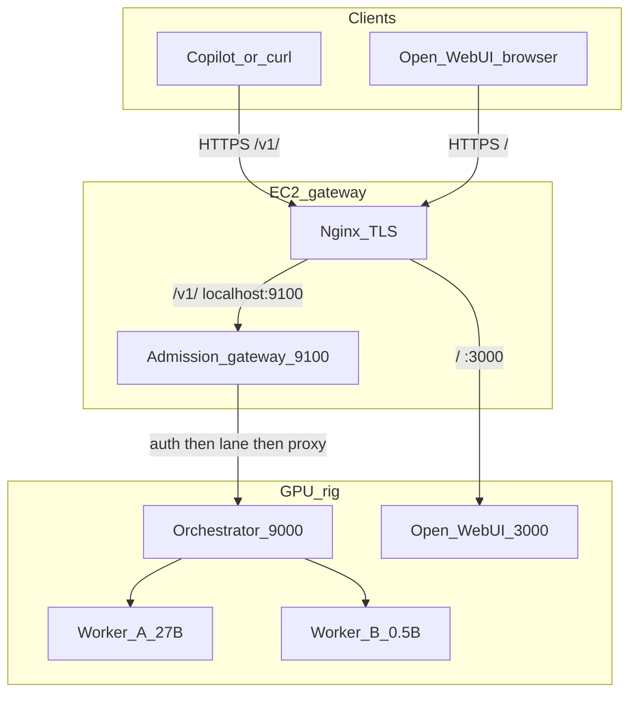

## Target request path



```mermaid
sequenceDiagram
    participant S as Student
    participant G as EC2_gateway
    participant R as Rig_orchestrator
    S->>G: POST /v1/chat/completions
    G->>G: Bearer auth
    alt waiting_line already 4
        G-->>S: 429 Retry-After
    else slot free or line has room
        G->>G: occupy waiter; SSE keepalives if streaming
        G->>G: acquire in-flight semaphore
        G->>R: proxy same OpenAI body
        R-->>G: SSE or JSON
        G-->>S: passthrough
    end
```

## Implementation

New package [`gateway/`](gateway/) (do not fold this into [`orchestrator/`](orchestrator/) — that code stays on the rig):

- [`gateway/config.py`](gateway/config.py) — `UPSTREAM_URL=http://100.75.123.203:9000`, `PUBLIC_API_KEYS`, per-model inflight/waiter limits, keepalive interval (~15s), upstream timeouts.
- [`gateway/auth.py`](gateway/auth.py) — same Bearer check as [`orchestrator/auth.py`](orchestrator/auth.py).
- [`gateway/lanes.py`](gateway/lanes.py) — one lane per model alias:
  - `asyncio.Semaphore(inflight)`
  - waiter counter with a mutex; increment **before** waiting; 429 if `waiting >= 4`
  - **FIFO:** do not `wait_for(sem.acquire())` in a retry loop (that cancels acquire and sends the client to the back of the line). Start **one** `acquire()` task; `asyncio.wait` on it with a 15s timeout only to emit keepalives / check disconnect; on client gone, cancel carefully and **release if the race acquired the semaphore**.
- [`gateway/main.py`](gateway/main.py):
  - `GET /healthz` — gateway process only (Nginx can keep public `/healthz` on the rig **or** switch it to the gateway; prefer gateway so a dead admission process is visible).
  - `GET /v1/models` — auth, then proxy to the rig with **no** lane.
  - `POST /v1/chat/completions` — auth → unknown model **404 without queueing** (same aliases as today) → lane → proxy.
  - Blocking: wait silently, then JSON proxy.
  - Streaming: `StreamingResponse` with `X-Accel-Buffering: no`, keepalives as SSE comments (`: queued\n\n`) until upstream bytes flow.
- [`gateway/proxy.py`](gateway/proxy.py) — httpx client to the rig; forward `Authorization` (student key is also valid on the rig today).

Systemd + env (EC2 only):

- [`systemd/ocs-gateway.service`](systemd/ocs-gateway.service) — bind `127.0.0.1:9100`, `python -m uvicorn`, after `network-online`.
- [`systemd/gateway.env.template`](systemd/gateway.env.template) — keys and limits; real file `/etc/ocs-gateway/gateway.env` mode `0600`, not committed.

Nginx (backup, `nginx -t`, reload — same care as Phase 6):

- In `/etc/nginx/sites-available/llm-relay`, change `location /v1/` `proxy_pass` from `http://100.75.123.203:9000` to `http://127.0.0.1:9100`.
- Raise `proxy_read_timeout` / `proxy_send_timeout` on `/v1/` to **3600s**. This is a **socket** safety net (wait-forever + no generation cap can otherwise sit past today’s 600s). Update the repo copy [`llm-relay-nginx.conf`](llm-relay-nginx.conf).
- Leave `location /` → Open WebUI unchanged.
