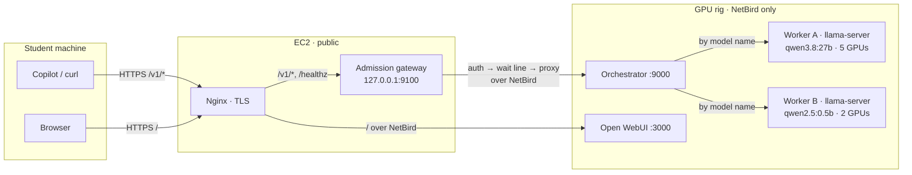

# Architecture overview

The whole system on one page. Each component has its own doc; this page shows how they fit together. It describes the design as deployed on 2026-09-18. For whether it is up **right now**, see [status](../status.md).

## What it does

Students point GitHub Copilot Chat (or curl, or any OpenAI client) at `https://ai.opencodingsociety.com/v1`. Their requests are answered by open-weight models running on donated GTX 1070s in the school. The browser chat UI (Open WebUI) stays at `/`.

The hard constraints that shape everything:

- **Old GPUs.** GTX 1070s are Pascal (`sm_61`) with 8 GB each, on PCIe Gen1 x1 risers with no NVLink ([hardware](./hardware.md)).
- **A hostile network.** The district network blocks common tunnels ([network](./network.md)).
- **Few GPU slots, many students.** The rig can run 1 large and 2 small generations at once, and a class sends far more ([gateway](./gateway.md)).

## Request path

Tokens stream back along the same path as Server-Sent Events. Every hop passes them through without buffering.

## Components

| Component | Runs on | Job | Doc |
|---|---|---|---|
| Nginx | EC2 | TLS, splits `/v1/` from `/` | [network](./network.md) |
| Admission gateway | EC2 | Checks the key, per-model FIFO wait line, 429 when full, proxies to the rig | [gateway](./gateway.md) |
| NetBird | both | Private overlay between EC2 and the rig. The rig has no public exposure. | [network](./network.md) |
| Orchestrator | rig | Routes by `model` to a worker, swaps the student key for the worker secret, polls worker health | [orchestrator](./orchestrator.md) |
| Worker A / B | rig | `llama-server` processes pinned to GPU groups | [workers](./workers.md) |
| Open WebUI | rig (Docker) | Browser chat. Skips the gateway. | — |

Addresses and ports: [hosts](../reference/hosts.md). Env vars: [configuration](../reference/configuration.md). Endpoints and errors: [API](../reference/api.md).

## Design principles

1. **Waiting happens on EC2. Inference happens on the rig.** The rig only ever receives work it can start right away ([decision 0005](../decisions/0005-admission-queue-on-ec2.md)).
2. **Speak OpenAI.** Students install nothing custom, and failures come back as standard HTTP codes (401 / 404 / 429) that Copilot already understands.
3. **Fewer PCIe hops per token.** Splitting the rig into GPU groups beats spanning all cards ([decision 0003](../decisions/0003-5-plus-2-gpu-split.md)).
4. **Thin layers, one job each.** Nginx does TLS, the gateway does admission, the orchestrator does routing, and llama.cpp does inference.

## Built vs planned

The [Week 0+1 deck](../sources/2026-09-28-week0-1-mentor-deck.md) shows a larger target architecture. This is what exists:

| Piece | State | Where it's tracked |
|---|---|---|
| Public `/v1` path, gateway, orchestrator, 2 workers | **Built** | this page |
| Per-student API keys, quotas, revocation | Planned. One shared key today. | [roadmap](../project/roadmap.md), [threat model](../security/threat-model.md) |
| FastAPI broker with Redis (live state) + RDS (durable state) | Planned (deck slides 07–08, 21) | [roadmap](../project/roadmap.md) |
| Rig 2 (dev and test) | Being built | [hardware](./hardware.md) |
| Monitoring (Prometheus, GPU exporter, Grafana) | Planned | [roadmap](../project/roadmap.md) |
| Model bake-off | Not run | [roadmap](../project/roadmap.md) |
